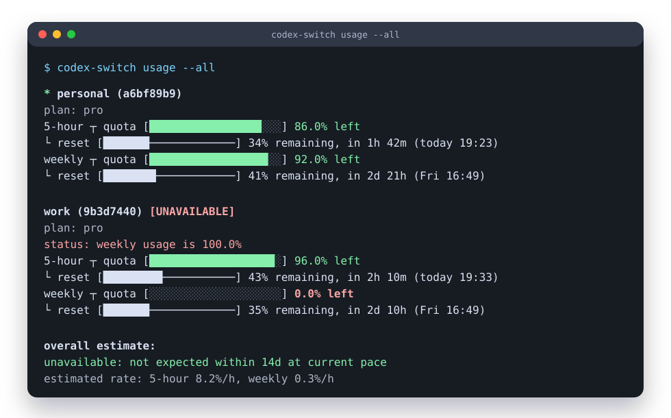
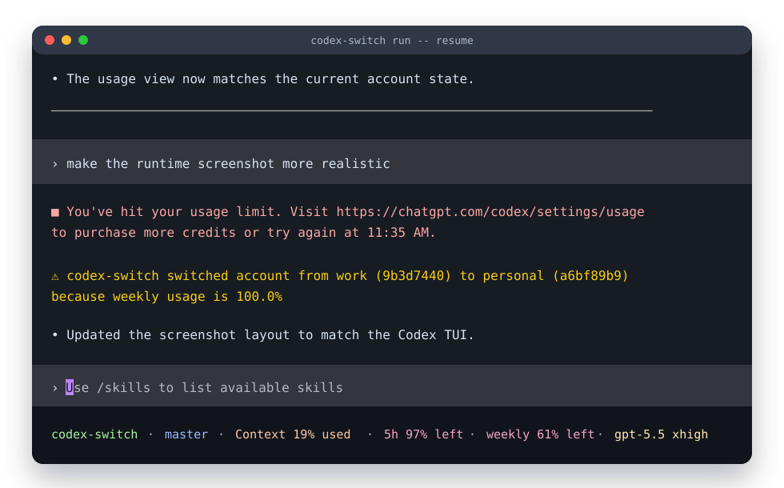

# codex-switch

Multi-account runtime switcher for Codex.

`codex-switch` lets you keep several ChatGPT Codex accounts on one machine and run Codex through a small local proxy. When the current account hits a usage limit, managed sessions try to hot-load another ChatGPT OAuth account with usable quota. If a replacement is available, the next turn can use it without manually editing `auth.json` or restarting Codex.





The main workflow is:

```sh
codex-switch login personal
codex-switch login work
codex-switch usage --all
codex-switch run -- resume
```

Use `codex-switch run` anywhere you would normally start an interactive Codex session. Codex arguments must be passed after `--`, so `codex-switch run -- resume` starts `codex resume` with runtime account switching enabled.

## Highlights

- Store and manage multiple Codex accounts locally.
- Login with ChatGPT/OpenAI OAuth, including browser login and device authorization.
- Import and export Codex-compatible `auth.json` files.
- Switch the active Codex account safely when unmanaged Codex processes are not running.
- Run Codex with runtime auto-switching for ChatGPT OAuth accounts.
- Show 5-hour, weekly, credit balance, available rate-limit resets when returned, and optional additional usage limits across accounts.
- Manually redeem earned ChatGPT rate-limit resets.
- Prefer accounts with usable quota and avoid accounts that are out of credits, rate-limited, or usage-limited.
- Keep secrets local under `~/.codex-switch` and write Codex auth files with private Unix permissions.

## Install

```sh
cargo install codex-switch
```

For local development:

```sh
cargo install --path .
```

## Commands

```sh
codex-switch list [--json]
codex-switch login <name> [--replace] [--device-auth]
codex-switch import <name> [--file <path>]
codex-switch export <name-or-id> [--file <path>] [--force]
codex-switch switch <name-or-id>
codex-switch disable <name-or-id>
codex-switch enable <name-or-id>
codex-switch auto-switch
codex-switch run [--codex-bin <path>]
codex-switch run [--codex-bin <path>] -- [CODEX_ARGS]...
codex-switch update [--check] [--version <version>]
codex-switch doctor [--codex-bin <path>] [--json]
codex-switch logs path
codex-switch logs latest
codex-switch logs tail [--lines <n>] [--follow]
codex-switch usage [--show-additional] [--json] [name-or-id]
codex-switch usage --all [--show-additional] [--json]
codex-switch reset-usage [name-or-id] [--yes]
codex-switch delete <name-or-id>
codex-switch rename <name-or-id> <new-name>
```

Most users only need these commands day to day:

```sh
codex-switch login <name>
codex-switch usage --all
codex-switch run -- resume
codex-switch switch <name-or-id>
```

## Storage

Accounts are stored in `~/.codex-switch/accounts.json`.

Switching writes Codex auth data to:

1. `$CODEX_HOME/auth.json`, when `CODEX_HOME` is set
2. `~/.codex/auth.json`, otherwise

On Unix, both files are written with `0600` permissions.

## Switching

`switch` refuses to write Codex auth data while unmanaged active Codex processes are detected. Close regular Codex sessions before switching accounts. Sessions launched through `codex-switch run` are managed by the local proxy, so `switch` is allowed while those sessions are running.

`auto-switch` also refuses to switch while Codex is running. When Codex is not running, it checks stored ChatGPT OAuth accounts and switches to the account selected by the quota-aware policy. Accounts that are out of credits, rate-limited, usage-limited, or at 100% usage are not selectable. API key accounts are not usage-checkable and are skipped as replacement candidates.

Use `disable` to keep an account stored but exclude it from automatic selection:

```sh
codex-switch disable work
codex-switch enable work
```

Disabled accounts are skipped by `auto-switch`, managed `run` runtime switching, and `usage --all` overall forecast capacity. They are not deleted and still work for explicit `switch`, `usage`, `export`, `rename`, and `delete` commands.

`run` is the runtime auto-switching entrypoint. It checks accounts before startup, starts `codex app-server`, launches Codex as a remote TUI through a local websocket proxy, and passes arguments after `--` to `codex`.

If the startup check finds that the current account is usage-limited but no usable replacement account exists, `run` continues with the current Codex auth instead of blocking startup.

During a managed session, codex-switch can switch the running Codex app-server to another ChatGPT OAuth account without restarting the TUI:

- Usage-limit errors trigger an immediate recovery attempt.
- Codex app-server `account/rateLimits/updated` notifications trigger immediate recovery for hard limit states, or a background re-check when the current account is near the shared 5% bottleneck headroom threshold.
- Best-effort background auto-switch checks run every 15-45 minutes.
- `codex-switch switch <name-or-id>` from another shell is hot-loaded by managed `run` sessions when the selected account is ChatGPT OAuth.

Normal rate-limit updates do not block the TUI on usage API calls.

`run` writes diagnostics to a per-process log file under `~/.codex-switch/logs/`. Before handing the terminal to Codex, startup diagnostics are also written to stderr using the default tracing format, including timestamp, level, target, and the log path, so startup hangs can be traced to initial auto-switch, app-server startup, proxy binding, or remote TUI spawn. After Codex TUI starts, codex-switch background diagnostics only go to the log file so they do not corrupt the TUI. Set `CODEX_SWITCH_LOG` to a level such as `off` or `debug`, or to a full tracing filter, to control this output.

Use `logs` to inspect existing runtime logs without starting Codex or creating a new log file:

```sh
codex-switch logs path
codex-switch logs latest
codex-switch logs tail
codex-switch logs tail --follow
codex-switch logs tail --lines 200
```

```sh
codex-switch run
codex-switch run -- resume
codex-switch run -- resume --last
codex-switch run -- resume <session-id>
```

`run` supports Codex interactive commands that accept `--remote`: the default TUI, `resume`, and `fork`. ChatGPT OAuth accounts are required for runtime switching. API key accounts are not usage-checkable and cannot be applied to the running app-server. Switching to an API key account still updates `auth.json` for the next Codex start, but existing managed `run` sessions keep their current runtime auth. The runtime switch applies through Codex's app-server auth API; an in-flight request may continue with the auth it already started with, so the request that first reports a usage-limit error may still fail before the next turn uses the replacement account.

## Doctor

`doctor` prints a local diagnostics report for the codex-switch installation, Codex CLI, account store, current Codex `auth.json`, sensitive file permissions, process detection, and runtime logs:

```sh
codex-switch doctor
codex-switch doctor --codex-bin /path/to/codex
```

The default checks are local-only and read-only. They do not call ChatGPT usage APIs, refresh tokens, write `accounts.json`, write Codex `auth.json`, consume rate-limit reset credits, or switch accounts. Run `doctor` before debugging `codex-switch run` startup hangs, unexpected account matching, unsafe permissions, or missing Codex remote TUI support.

## Login

`login` uses ChatGPT/OpenAI browser OAuth by default. It starts a local callback server, opens the browser, and saves the account. It does not write Codex `auth.json`; run `codex-switch switch <name-or-id>` when you want to use the new account.

The browser callback server uses the same ports as Codex: `1455` by default, with `1457` as the fallback.

Use `codex-switch login <name> --device-auth` for device authorization. The CLI prints a verification URL and one-time code, then waits for authorization.

Use `codex-switch login <name> --replace` to re-login an existing stored ChatGPT OAuth account after its credentials stop refreshing. The target name must already exist. Replacement happens only after OAuth succeeds, preserves the stored account ID and timestamps, and does not write Codex `auth.json`; run `codex-switch switch <name-or-id>` to apply the refreshed credentials to Codex. API key accounts cannot be replaced by `login --replace`.

## Import

`import` reads an existing Codex `auth.json`. When `--file` is omitted, it imports from the current Codex auth file: `$CODEX_HOME/auth.json` when `CODEX_HOME` is set, otherwise `~/.codex/auth.json`. API key and regular ChatGPT OAuth auth files are supported. Agent identity auth files and externally managed `chatgptAuthTokens` files are not supported because codex-switch cannot refresh or switch those credentials safely.

`login` and `import` reject accounts that match an already stored auth identity. `login --replace` allows replacing the target account's own auth identity, but still rejects an identity that belongs to another stored account.

## Export

`export` writes a stored account as Codex-compatible `auth.json` JSON. By default it prints to stdout:

```sh
codex-switch export my-account
```

The exported JSON contains credentials. Treat stdout and exported files as secrets.

Use `--file` to write to a file. Existing files are not overwritten unless `--force` is passed.

```sh
codex-switch export my-account --file ./auth.json
codex-switch export my-account --file ./auth.json --force
```

Exporting does not change the current Codex auth file.

## Update

`update` checks GitHub Releases and updates the current installation:

```sh
codex-switch update --check
codex-switch update
codex-switch update --version 0.1.10
```

For release binaries, the updater verifies the GitHub release asset SHA-256 digest before replacing the executable. It does not run `sudo`; if the current executable path is not writable, rerun your install script or install the binary with elevated permissions.

If codex-switch was installed from crates.io with Cargo in a tracked Cargo install root, `update` delegates to Cargo and installs the exact matching crates.io version into the same root, so `cargo` must be available. Cargo installs from local paths or git sources are not rewritten by `update`; reinstall them manually.

## Usage

Usage reporting is supported for ChatGPT OAuth accounts. API key accounts are listed as unsupported for usage.

When ChatGPT returns earned rate-limit reset credits, `usage` prints the available count for each account. Use `reset-usage` to manually consume one reset for the selected account:

```sh
codex-switch reset-usage my-account
codex-switch reset-usage my-account --yes
```

When no account is passed, `reset-usage` uses the current Codex auth account. The command requires ChatGPT OAuth and asks for confirmation unless `--yes` is passed. It does not run automatically from `run` or `auto-switch`.

`usage --all` also prints an overall estimate for the ChatGPT OAuth account pool based on the current 5-hour and weekly usage snapshot. The estimate starts from the current account when it has usable usage data, periodically reapplies the account selection policy, and reports the estimated 5-hour and weekly usage rates when enough samples are available.

Additional usage limits are hidden by default. Pass `--show-additional` to include them.

## JSON Output

`list`, `usage`, and `doctor` support `--json` for scripts and statusline integrations:

```sh
codex-switch list --json
codex-switch usage --all --json
codex-switch doctor --json
```

JSON output is printed to stdout, while diagnostics and command errors stay on stderr. Each JSON document includes `schema_version: 1` and omits credentials such as API keys, ID tokens, access tokens, refresh tokens, and raw Codex auth JSON.

## Release

The GitHub Actions release workflow builds Linux musl binaries for `aarch64` and `x86_64`, plus a macOS arm64 binary. On pushes to `master`, it compares the current Cargo package version with the previous `Cargo.toml` version. When the version changes, it creates tag `v{version}`, creates a GitHub release, uploads the raw binaries, and publishes the crate to crates.io.

Publishing to crates.io requires a repository Actions secret named `CARGO_REGISTRY_TOKEN`.

```text
codex-switch-aarch64-unknown-linux-musl
codex-switch-x86_64-unknown-linux-musl
codex-switch-aarch64-apple-darwin
```

## Development

```sh
cargo fmt --check
cargo check --locked --all-targets --all-features
cargo test --locked --all-targets --all-features
cargo clippy --locked --all-targets --all-features -- -D warnings
```
